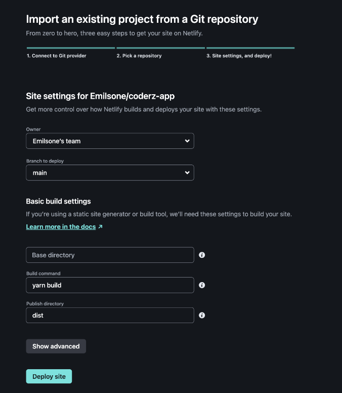

---

## Introduction

- JS framework for building user interfaces.
- Created by Evan You.
- Unlike other big frameworks (React, Angular), Vue isn't maintained by a large corporation such as Meta or Google.
- Like React, it builds on top of HTML, CSS and JS.
- Used to develop single-page applications.

---

## Why Vue (not exclusive)

- Creates dynamic frontend apps
- Component-based architecture promotes reusability
- Easy to integrate with other projects
- Integrates well with backend systems to make full stack.
- Virtual DOM, fast
- Good community

---

## Why Vue? (exclusive)

- Vue is simple and intuitive to learn.
- Inspired from Angular as best parts of Angular extracted, leaving behind the limitations.
- Doesn't contain the complexities of other frameworks. Syntax etc.
- Can be used on server-side when used with SSR framework (Nuxt).
- Extremely lightweight

---

## Layout

```html
<!DOCTYPE html>
<html lang="en">
  <head>
    ...
  </head>
  <body>
    <div id="app"></div>
  </body>
</html>
```

---

```javascript
const app = Vue.createApp({
    template: '<h1>Hello World</h1>',
})

app.mount(#app);
```

---

```html
<!DOCTYPE html>
<html lang="en">
  <head>
    ...
  </head>
  <body>
    <div id="app">{{message}}</div>
  </body>
</html>
```

---

```javascript
const app = Vue.createApp({
    data() {
        message: "Hello World",
    }
})

app.mount(#app);
```

---

## Advantages

- Short learning curve
- Good community support
- Shortest startup time

## Disadvantages

- Doesn't render in older operating systems
- Not as trustworthy overall as not backed by large organisation
- Developed in China, so most documentations in Chinese

---

## Vue vs Jquery

---

## Deployment

Decide which hosting service to deploy your vue app

- Free services: Render, Github pages
- Free with usage limits: Netlify, Vercel, Amazon S3, Firebase
- Paid services: Heroku

---

### Prerequisites:

- Preview locally prior to deployment, for example:

```shell
$ npm install -g serve
$ serve -s dist
```

- Configure CORS if your static frontend is deployed to a different domain from your backend API

---

### Deployment with Netlify

- Build Command: npm run build or yarn build
- Publish directory: dist
  

---

## Companies that use it

- Adobe
- Grammarly
- Facebook

---

### Adobe

- Portfolio is a custom website builder for users to make a portfolio of their work
- Vue was easy to integrate with the existing codespaces

  https://portfolio.adobe.com/examples/

---

### Grammarly

- It built an online editor with vue.js that you can use to check large sections of text
- Grammarly for developers and Grammarly SDK discontinued :(
