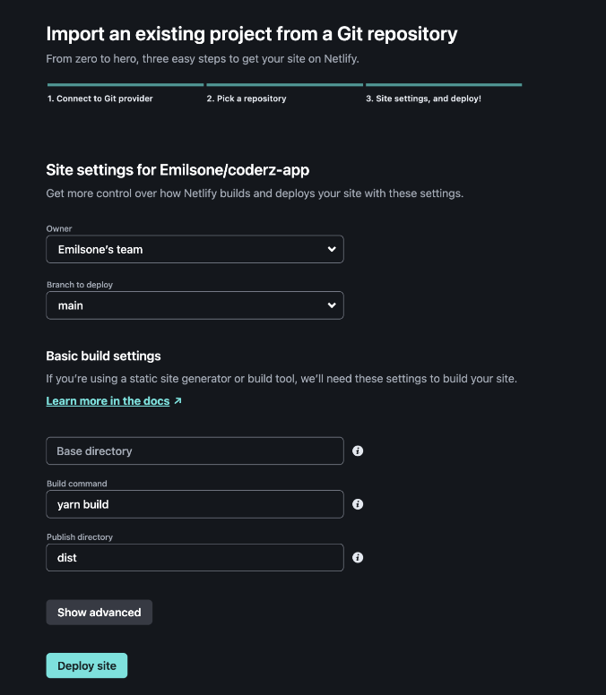

## Facilitating tools

- Bit
  - developers can adopt a component-driven approach to building Vue.js apps
  - enabling sharing and reusability of components across projects and teams.
- Vite
  - a local development server
  - smooth/fast build tool
  - boasts a significantly faster development server compared to Vue CLI (10–100x faster)
- Pinia: Management library
  - focus on performance and efficience
  - ensuring that state management operations have minimal impact on the overall application performance
- Vue-router
  - Vue.js router library for building single-page applications
  - navigate between different views and components in a Vue.js application
    -offers features like route guards for authentication and navigation control

## Deployment

Decide which hosting service to deploy your vue app:

- Free services: Render, Github pages
- Free with usage limits: Netlify, Vercel, Amazon S3, Firebase
- Paid services: Heroku

### Prerequisites:

- Develop vue app and push to git
- Preview locally prior to deployment, for example:

```shell
$ npm install -g serve
$ serve -s dist
```

- serve used specifically for running a project locally during development, providing a development server and automatic reloading
- Configure CORS if your static frontend is deployed to a different domain from your backend API

### Deployment with Netlify

- Build Command: npm run build or yarn build
- Publish directory: dist
  

## Companies that use it

- Adobe - Portfolio
- Grammarly - text editor
- Facebook - used Vue.js for a part of its Newsfeed
- Netflix
  - applied Vue.js in two of its smaller, internal apps
  - Vue.js handy for building movie streaming interfaces

### Adobe

- Portfolio is a custom website builder for users to make a professional portfolio of their work
- Vue was easy to integrate with the existing codespaces
- Adobe was able to maintain the user experience and performance

### Grammarly

- It built an online editor with vue.js that you can use to check large sections of text
- Grammarly for developers and Grammarly SDK - the developer tool that puts the company’s automated editing functionality into any app with a few lines of code
- This was discontinued in Jan 2024
